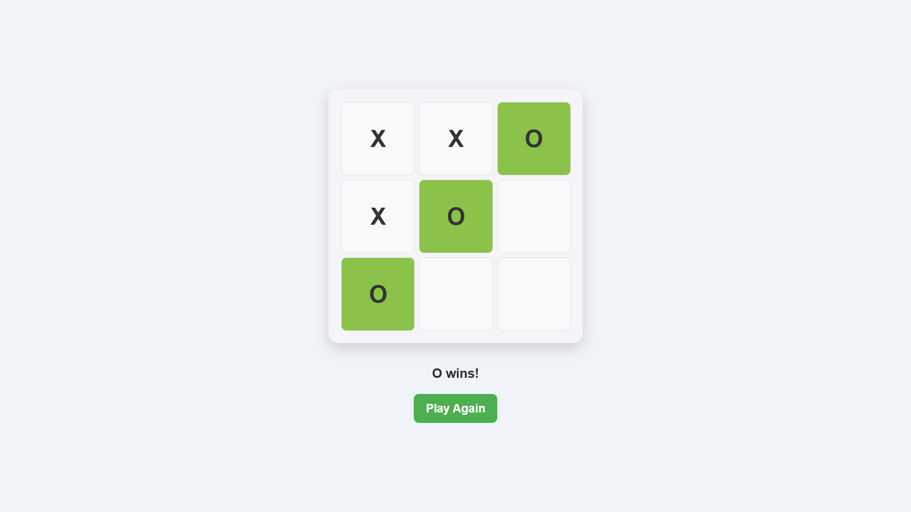
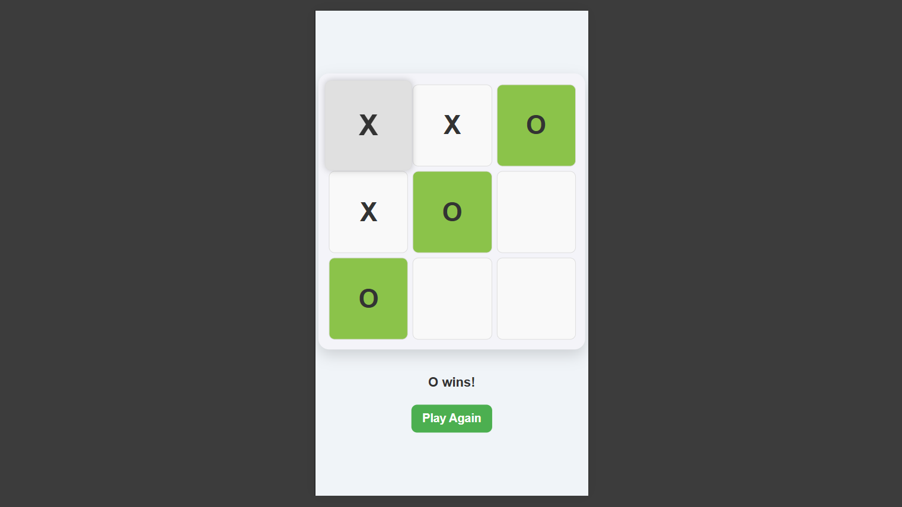

# 🎮 JavaScript XO Game

This is a **Tic-Tac-Toe (XO) game** implemented using **HTML, CSS, and JavaScript**. The game allows **two players** to compete on a **3x3 grid**.  

## 👀 Preview

### 💻 **Desktop**


### 📱 **Mobile**


## 🚀 Features 

- ✅ **Responsive Design:** The game adapts to **all screen sizes**.
- 🎮 **Interactive Game Board:** Players can **place X or O** by clicking on cells.
- 🏆 **Winner Highlight:** The **winning combination** is highlighted in **green**.
- 🤝 **Draw Detection:** If the game ends in a draw, a **message is displayed**.
- 🔄 **Play Again Button:** A **restart button** allows players to reset the game and play again.

## 🛠️ Installation  

To set up and run the XO Game on your local machine:  

### 1️⃣ **Clone the Repository**  
```bash
<<<<<<< HEAD
git clone https://github.com/Iqbolshoh/javascript-xo-game.git
=======
git clone https://github.com/M-Ahmad-79/Game.git
>>>>>>> ce7e01d3f4acb88eeee693dce1af355cb94189fb
```
### 2️⃣ **Navigate to the Project Directory**  
```bash
cd javascript-xo-game
```
### 3️⃣ **Open the `index.html` File**  
Simply open the `index.html` file in any modern **web browser** to start playing.  

## 🖥 Technologies Used


## 📜 License
This project is open-source and available under the **MIT License**.

## 🤝 Contributing  
🎯 Contributions are welcome! If you have suggestions or want to enhance the project, feel free to fork the repository and submit a pull request.
<<<<<<< HEAD

## 📬 Connect with Me  
💬 I love meeting new people and discussing tech, business, and creative ideas. Let’s connect! You can reach me on these platforms:

<div align="center">
  <table>
    <tr>
      <td>
        <a href="mailto:mahmad937ak@gmail.com" target="_blank">
          
        </a>
      </td>
      <td>
        <a href="www.linkedin.com/in/muhammad-ahmad-788b62338" target="_blank">
          
        </a>
      </td>
    </tr>
  </table>
</div>
=======
>>>>>>> ce7e01d3f4acb88eeee693dce1af355cb94189fb
